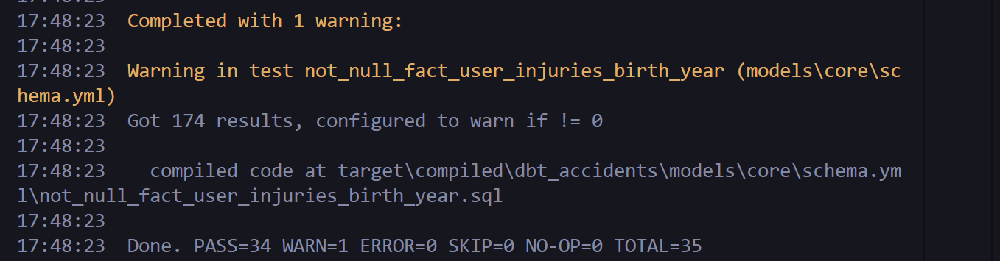

# Accidents en France de 2005 à 2023

## Présentation
Ce projet analyse les données des accidents de la route en France à l'aide de DBT (Data Build Tool) pour modéliser, tester et documenter les données. L'objectif est de fournir des tables propres et prêtes pour l'analyse et le reporting.


 ## Architecture du projet


## Source des données
Les données proviennent du site officiel de la Direction Interministérielle du Numérique : https://www.data.gouv.fr/datasets/bases-de-donnees-annuelles-des-accidents-corporels-de-la-circulation-routiere-annees-de-2005-a-2023/

Les données d’entrée et de sortie sont stockées sur GCP BigQuery.

## Prérequis
- Python 3.8+
- DBT (dbt-core, dbt-utils)
- Les bibliothèques Python listées dans `requirements.txt`
- Système d'exploitation : Windows (scripts d'installation dédiés)
- Base de données BigQuery(GCP)

## Installation

### 1. Créer un environnement virtuel Python
```cmd
bin\windows\install_python_venv.bat
```

### 2. Installer les bibliothèques Python
```cmd
bin\windows\install_python_libraries.bat
```

### 3. Installer DBT et les packages nécessaires
```cmd
bin\windows\install_dbt_libraries.bat
```

### 4. Configurer DBT
Modifiez le fichier `dbt_accidents/profiles.yml` avec les informations de connexion à votre base de données.
Vérifiez la configuration dans `dbt_accidents/config/`.

## Utilisation

### Exécuter DBT
Dans le dossier du projet DBT :
```cmd
cd dbt_accidents
dbt run
dbt test
dbt docs generate
dbt docs serve
```

### Structure du projet
- `dbt_accidents/` : Projet principal DBT
  - `models/` : Modèles de données (staging, intermediate, core)
  - `macros/` : Macros DBT personnalisées
  - `analyses/`, `seeds/`, `snapshots/` : Extensions
  - `dbt_packages/` : Packages DBT externes (ex : dbt_utils)
  - `config/` : Fichiers de configuration
  - `target/` : Résultats de compilation et d'exécution DBT
  - `test/`: Tests DBT
- `bin/windows/` : Scripts d'installation pour Windows
- `requirements.txt` : Liste des bibliothèques Python

## Tests
Le resultat de l'execution de "dbt test" est le suivant:



